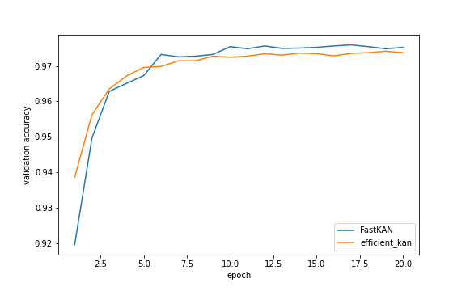

# FastKAN: Very Fast Kolmogorov-Arnold Network via Radial Basis Functions

## Introduction

This repository contains a very fast implementation of the Kolmogorov-Arnold Network (KAN), by replacing the 3-order B-spline basis in the original KANs with Radial Basis Functions (RBFs). 

The forward time of FaskKAN is 3.33x faster than [efficient KAN](https://github.com/Blealtan/efficient-kan), and the implementation is a LOT easier.

The original implementation of KAN is [pykan](https://github.com/KindXiaoming/pykan).

## Installation

One can install fast-kan via pip:

```bash
git clone https://github.com/ZiyaoLi/fast-kan
cd fast-kan
pip install .
```

Run an example training of the FastKAN network on MNIST:

```bash
python examples/train_mnist.py
```

## What FastKAN Does

1. Uses Gaussian Radial Basis Functions to approximate the B-spline basis, which is the bottleneck of KAN and efficient KAN:

$$b_{i}(u)=\exp\left(-\left(\frac{u-u_i}{h}\right)^2\right)$$

The rationale for doing so is that these RBF functions well approximate the B-spline basis (up to a linear transformation) and are very easy to calculate (as long as the grids are uniform). Results are shown in the figure below (code in [notebook](notebooks/test_spline_basis.ipynb)). 


2. Uses LayerNorm to scale inputs to the range of spline grids, so there is no need to adjust the grids.

3. FastKAN is 3.33x compared with efficient_kan in forward speed. (see [notebook](notebooks/test_running_time.ipynb), 742us -> 223us on V100)

4. Accuracy on MNIST is equivalent / slightly improved.



5. *More importantly*, the approximation made in FastKAN suggests that KAN is equivalent to a certain RBF Network. This finding bridges between RBF Networks and KANs.

## Plot the learned curves

FastKANLayer supports users in plotting the learned curves dim-by-dim. See [notebook](notebooks/example_plot_activation.ipynb) for an example of usage.


## Cite This Work

Copyright 2024 Li, Ziyao. Licensed under the Apache License, Version 2.0.

```bibtex
@article{li2024kolmogorovarnold,
      title={Kolmogorov-Arnold Networks are Radial Basis Function Networks}, 
      author={Ziyao Li},
      year={2024},
      eprint={2405.06721},
      archivePrefix={arXiv},
      primaryClass={cs.LG}
}
```
