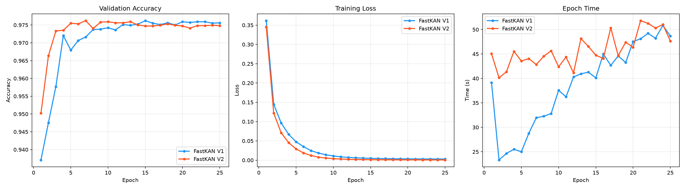
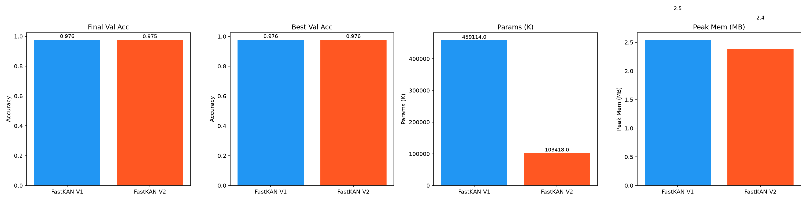

# FastKAN V1 vs V2 — MNIST Benchmark Report

## Configuration

| Setting | Value |
|---|---|
| Dataset | MNIST |
| Input | 28×28 = 784 |
| Epochs | 25 |
| Batch Size | 64 |
| Optimizer | AdamW (lr=1e-3, wd=1e-4) |
| Scheduler | ExponentialLR (gamma=0.8) |

## Results Summary

| Metric | FastKAN V1 | FastKAN V2 |
|---|---|---|
| Parameters | `459,114` | `103,418` |
| Final Train Acc | `1.0000` | `1.0000` |
| Final Val Acc | `0.9756` | `0.9748` |
| Best Val Acc | `0.9762` | `0.9762` |
| Final Train Loss | `0.0029` | `0.0006` |
| Final Val Loss | `0.0905` | `0.1105` |
| Avg Epoch Time (s) | `38.720` | `45.797` |
| Total Train Time (s) | `968.00` | `1144.93` |
| Peak Memory (MB) | `2.54` | `2.38` |

## Per-Epoch Validation Accuracy

| Epoch | FastKAN V1 | FastKAN V2 |
|---|---|---|
| 1 | `0.9371` | `0.9502` |
| 2 | `0.9476` | `0.9664` |
| 3 | `0.9577` | `0.9733` |
| 4 | `0.9720` | `0.9735` |
| 5 | `0.9680` | `0.9755` |
| 6 | `0.9706` | `0.9753` |
| 7 | `0.9716` | `0.9762` |
| 8 | `0.9737` | `0.9740` |
| 9 | `0.9738` | `0.9758` |
| 10 | `0.9742` | `0.9759` |
| 11 | `0.9736` | `0.9756` |
| 12 | `0.9751` | `0.9756` |
| 13 | `0.9749` | `0.9759` |
| 14 | `0.9752` | `0.9750` |
| 15 | `0.9762` | `0.9747` |
| 16 | `0.9755` | `0.9747` |
| 17 | `0.9751` | `0.9749` |
| 18 | `0.9756` | `0.9753` |
| 19 | `0.9750` | `0.9749` |
| 20 | `0.9759` | `0.9747` |
| 21 | `0.9757` | `0.9741` |
| 22 | `0.9759` | `0.9748` |
| 23 | `0.9759` | `0.9748` |
| 24 | `0.9755` | `0.9749` |
| 25 | `0.9756` | `0.9748` |

## Plots

- 

- 
